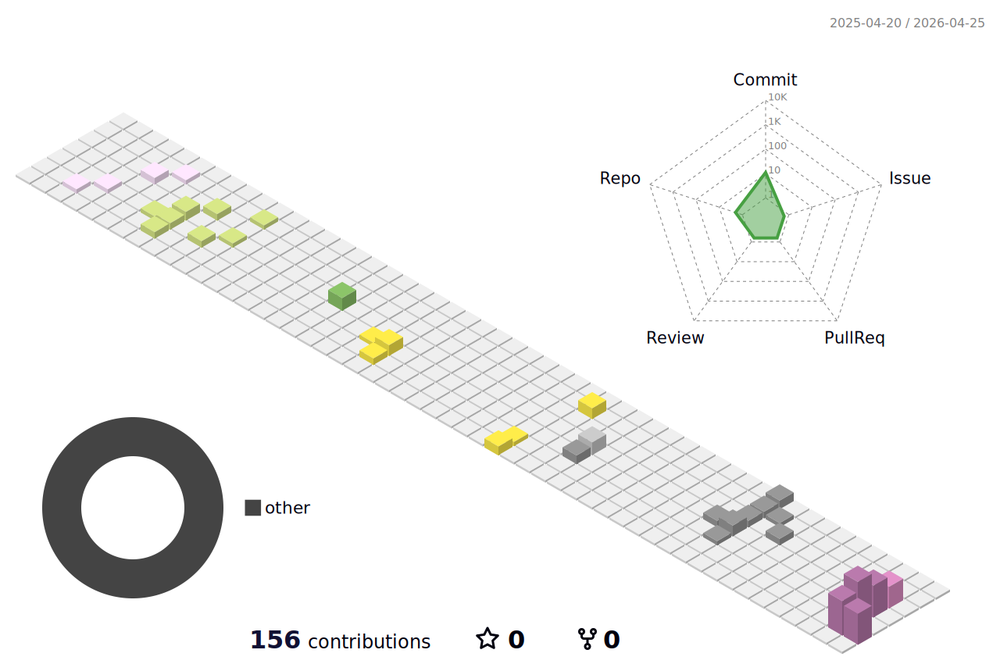

<div align="center">



</div>

&nbsp;

```
$ whoami
─────────────────────────────────────────────────────────
jason liu · @kelbimon · marketing, tech, agentic systems,
                        fullstack engineer, security
```

&nbsp;

## `$ contrib --3d`

<div align="center">



</div>

&nbsp;

## `$ contrib --snake`

<div align="center">


</div>

&nbsp;

## `$ stack`

```
typescript · next · react · tailwind
python     · fastapi
supabase   · postgres
vercel     · cloudflare
zsh        · tmux     · nvim · git
```

&nbsp;

## `$ meta`

```
source        100% private repos
built-with    .github/workflows/
last-build    see commit history
```

&nbsp;

<div align="center">
<sub><code>exit 0</code></sub>
</div>
