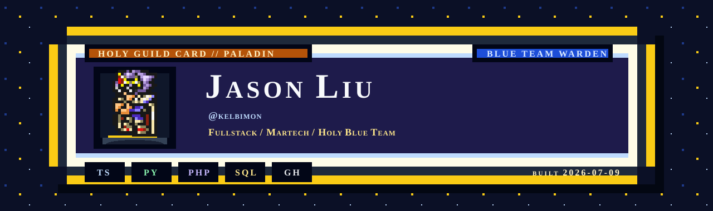
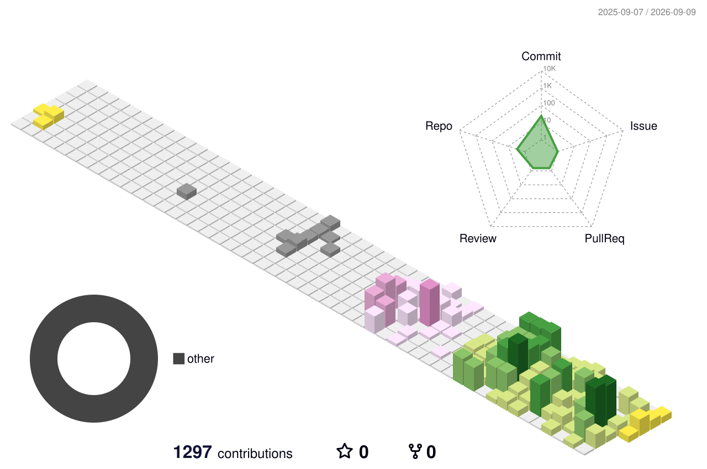

<div align="center">



</div>

&nbsp;

```
$ oath
jason liu · @kelbimon
Head of Tech & Marketing - VIC Group · fullstack · holy blue team
```

&nbsp;

## `$ campaign`

<div align="center">




</div>

&nbsp;

## `$ armory`

```
frontend   · typescript · next · tanstack query · tailwind
backend    · python · fastapi · node · php/yii2 (legacy)
data       · postgres · supabase · mysql
infra      · vercel · cloudflare · aws · digitalocean
devops     · docker · github actions · ci/cd
ai         · llm agents · meta capi · whatsapp cloud api
security   · pentesting · incident response · hardening
```

&nbsp;

<div align="center">
<sub><code>oath sealed</code></sub>
</div>
